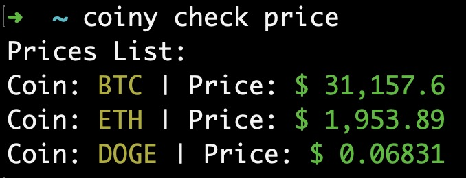
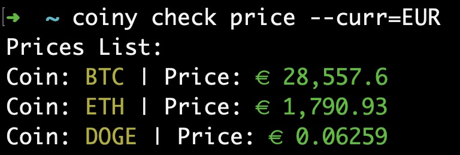
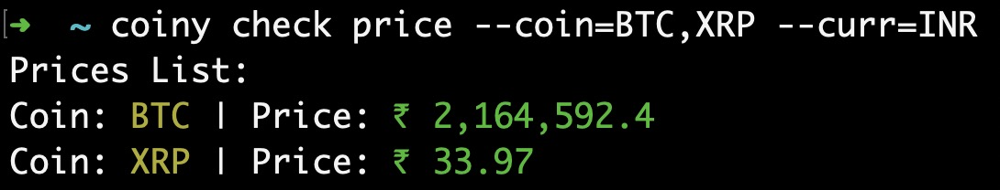
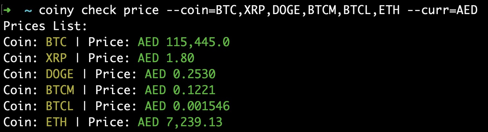

# Coiny

## Description

- Coiny is a command line tool to get the latest prices of different cryptocurrencies in various currency options. The default currency is USD.
- It uses the Crypto Compare API. Users should first get an API Key (free) from [here](https://www.cryptocompare.com/cryptopian/api-keys) (free) and set the key using the CLI.
- Requires Node 20 or above.

## Usage

1. coiny

   ```
   Usage: coiny [options] [command]

   Options:
    -V, --version   output the version number
    -h, --help      display help for command

   Commands:
    key             Manage API key -> Get at https://www.cryptocompare.com/cryptopian/api-keys
    check           Check cryptocurrency coins prices
    help [command]  display help for command
   ```

2. coiny key

   ```
   Usage: coiny-key [options] [command]

   Options:
    -h, --help      display help for command

   Commands:
    set             Set API Key -> Get at https://www.cryptocompare.com/cryptopian/api-keys
    show            Show API Key
    remove          Remove API Key
    help [command]  display help for command
   ```

3. coiny check

   ```
   Usage: coiny-check [options] [command]
    Options:
    -h, --help display help for command

   Commands:
    price [options] Check price of coins
    help [command] display help for command
   ```

4. coiny check price

   ```
   Usage: coiny-check price [options]

   Check price of coins

   Options:
    --coin <type> Add specific coin types (comma separated) (default: "BTC,ETH,DOGE")
    --curr <currency> Change the currency (default: "USD")
    -h, --help display help for command
   ```

## Examples

### Check prices

- 
- 
- 
- 
